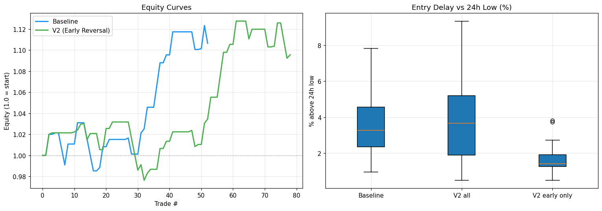
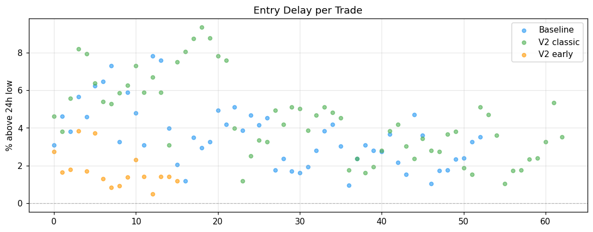

# 🔬 Bot 2 v2 — Structural Backtest Report

**Generated:** 2026-04-20 14:25 UTC
**Period:** 2026-01-08 → 2026-04-20
**Rows analyzed:** 2438 (1h candles)

## 🎯 Critério de Aceite

| Critério | Threshold | Resultado |
|----------|-----------|-----------|
| early_advantage > 0.3% | 0.3% | 0.05% ❌ |
| winrate_drop < 5pp | 5pp | -2.75pp ✅ |
| dd_ratio ≤ 1.2x | 1.2x | 1.21x ❌ |
| false_signal_rate < 30% | 30% | 7.6% ✅ |

### Veredicto: ❌ REJEITAR V2

## 📊 Comparação Global

| Métrica | Baseline | V2 | Δ |
|---------|----------|-----|---|
| n_trades | 53 | 79 | +26 |
| winrate | 33.96% | 36.71% | +2.75pp |
| avg_return | 0.20% | 0.12% | -0.08pp |
| total_return | 10.65% | 9.55% | -1.10pp |
| sharpe | 1.364 | 1.171 | -0.193 |
| profit_factor | 1.868 | 1.573 | -0.295 |
| max_drawdown | -4.43% | -5.37% | -0.93pp |
| avg_entry_delay_pct | 3.57% | 3.91% | +0.34pp |
| false_signal_rate | 7.55% | 7.59% | +0.05pp |
| avg_hold_hours | 4.000 | 3.797 | -0.203 |

**Early Advantage:** `0.05%`

## 🎯 V2 por Entry Mode

| Mode | N | WR | AvgRet | PF | MaxDD | FalseSig | AvgHold |
|------|---|-----|--------|-----|-------|----------|---------|
| classic | 63 | 33.3% | 0.17% | 2.02 | -3.41% | 4.8% | 3h |
| early | 16 | 50.0% | -0.08% | 0.79 | -2.98% | 18.8% | 6h |

**Interpretação:**
- `classic`: deve ser idêntico ao baseline (mesma lógica)
- `early`: early entries trazem edge ou destroem risco?

## 📤 Distribuição de Saídas

**Baseline:** TRAIL=35, TP=10, SL=8
**V2:** TRAIL=59, SL=11, TP=9

## 📊 Plots

