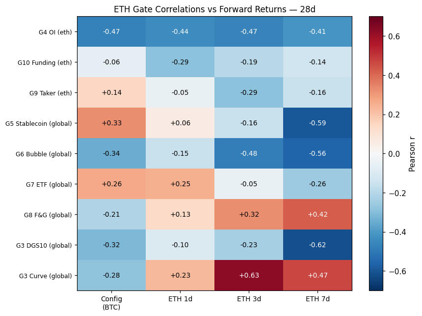
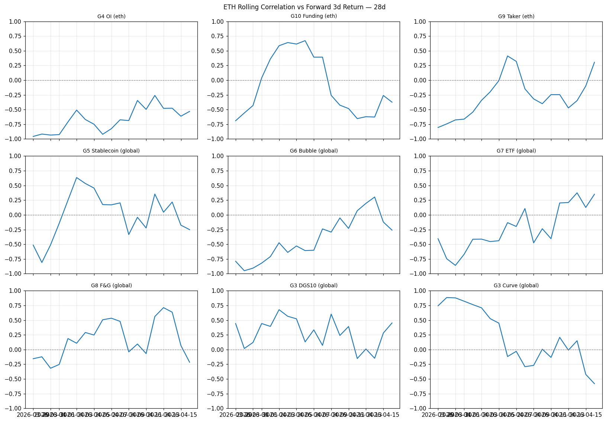
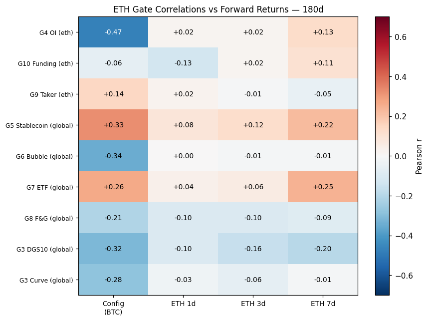
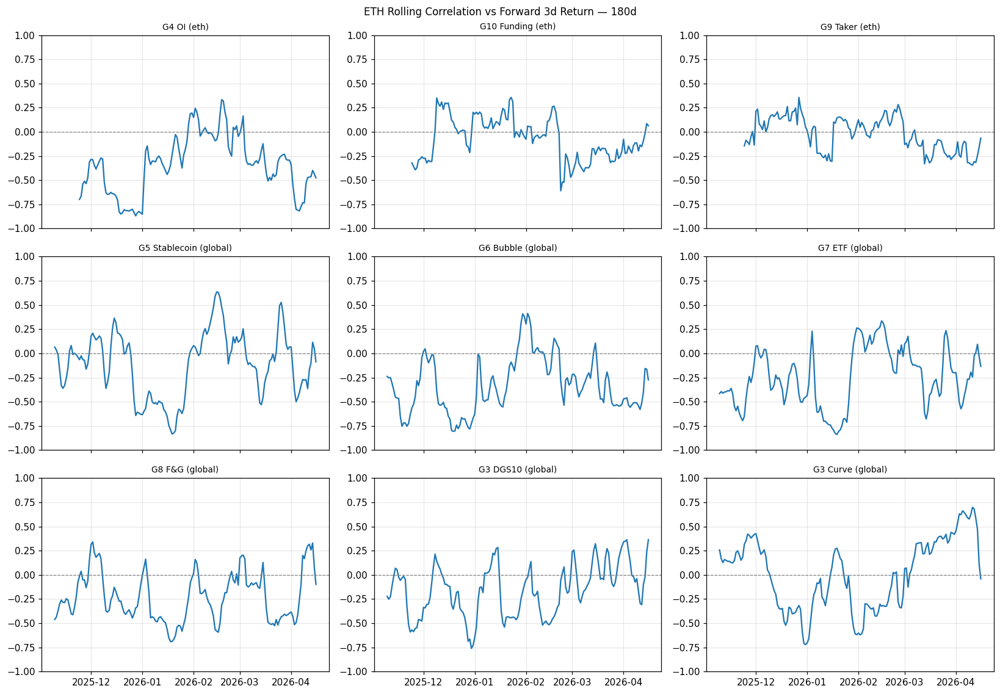

# 🔬 ETH Phase 0 — Statistical Descriptive Study

**Generated:** 2026-04-19 22:06 UTC

**Objetivo:** Verificar transferibilidade dos gates BTC → ETH antes de calibrar `parameters_eth.yml`.

## Janela 28d

### Regime ETH

| Métrica | Valor |
|---------|-------|
| n_days | 29 |
| price_start | 2053.89 |
| price_end | 2286.62 |
| total_return_pct | 11.33 |
| daily_vol_pct | 3.13 |
| annualized_vol_pct | 59.81 |
| max_drawdown_pct | -8.5 |
| autocorr_1d | -0.219 |
| skew | 0.437 |
| kurtosis | 0.193 |

### Alinhamento com BTC config

- **Model Alignment:** `0.664` (9 gates)
- **Avg Delta:** `0.336`
- **Distribuição:** {'🔴 broken (inv)': 5, '✅ aligned': 4}

### Correlações por gate

| Gate | Fonte | Config (BTC) | ETH 1d | ETH 3d | ETH 7d | Δ_3d | n | Status |
|------|-------|-------------|--------|--------|--------|------|---|--------|
| G4 OI | eth | -0.472 | -0.44 | -0.47 | -0.411 | 0.002 | 22 | ✅ aligned |
| G10 Funding | eth | -0.064 | -0.286 | -0.192 | -0.139 | 0.128 | 22 | ✅ aligned |
| G9 Taker | eth | 0.143 | -0.053 | -0.289 | -0.158 | 0.432 | 22 | 🔴 broken (inv) |
| G5 Stablecoin | global | 0.326 | 0.055 | -0.156 | -0.595 | 0.482 | 22 | 🔴 broken (inv) |
| G6 Bubble | global | -0.345 | -0.155 | -0.485 | -0.559 | 0.14 | 22 | ✅ aligned |
| G7 ETF | global | 0.263 | 0.25 | -0.051 | -0.256 | 0.314 | 22 | 🔴 broken (inv) |
| G8 F&G | global | -0.211 | 0.133 | 0.324 | 0.422 | 0.535 | 22 | 🔴 broken (inv) |
| G3 DGS10 | global | -0.315 | -0.1 | -0.235 | -0.616 | 0.08 | 22 | ✅ aligned |
| G3 Curve | global | -0.282 | 0.228 | 0.628 | 0.468 | 0.91 | 22 | 🔴 broken (inv) |

## Janela 180d

### Regime ETH

| Métrica | Valor |
|---------|-------|
| n_days | 181 |
| price_start | 3873.05 |
| price_end | 2286.62 |
| total_return_pct | -40.96 |
| daily_vol_pct | 3.66 |
| annualized_vol_pct | 69.97 |
| max_drawdown_pct | -56.07 |
| autocorr_1d | 0.002 |
| skew | 0.04 |
| kurtosis | 2.121 |

### Alinhamento com BTC config

- **Model Alignment:** `0.782` (9 gates)
- **Avg Delta:** `0.218`
- **Distribuição:** {'⚠️ attention': 4, '✅ aligned (inv)': 2, '🔴 broken (inv)': 1, '🔴 broken': 1, '✅ aligned': 1}

### Correlações por gate

| Gate | Fonte | Config (BTC) | ETH 1d | ETH 3d | ETH 7d | Δ_3d | n | Status |
|------|-------|-------------|--------|--------|--------|------|---|--------|
| G4 OI | eth | -0.472 | 0.019 | 0.019 | 0.128 | 0.491 | 159 | 🔴 broken (inv) |
| G10 Funding | eth | -0.064 | -0.127 | 0.02 | 0.107 | 0.084 | 159 | ✅ aligned (inv) |
| G9 Taker | eth | 0.143 | 0.024 | -0.007 | -0.053 | 0.15 | 159 | ✅ aligned (inv) |
| G5 Stablecoin | global | 0.326 | 0.083 | 0.122 | 0.219 | 0.204 | 174 | ⚠️ attention |
| G6 Bubble | global | -0.345 | 0.003 | -0.011 | -0.014 | 0.334 | 174 | 🔴 broken |
| G7 ETF | global | 0.263 | 0.038 | 0.056 | 0.246 | 0.207 | 174 | ⚠️ attention |
| G8 F&G | global | -0.211 | -0.101 | -0.1 | -0.086 | 0.111 | 174 | ✅ aligned |
| G3 DGS10 | global | -0.315 | -0.103 | -0.159 | -0.196 | 0.156 | 174 | ⚠️ attention |
| G3 Curve | global | -0.282 | -0.03 | -0.061 | -0.014 | 0.221 | 174 | ⚠️ attention |

## 💡 Guia de decisão

| Alignment | Decisão |
|-----------|---------|
| > 0.7 | Copiar parameters.yml como baseline ETH — ajuste mínimo |
| 0.4 – 0.7 | Adaptive layer suficiente — ajustar corr_cfg dos gates ⚠️ |
| < 0.4 | Recalibração manual necessária antes de paper trading |

**Gates ✅ aligned:** transferíveis direto
**Gates ⚠️ attention:** ajustar `corr_cfg` no parameters_eth.yml
**Gates 🔴 broken:** remover ou desativar para ETH
**Gates (inv):** sinal invertido — requer atenção especial

## 🎯 Próximos passos

1. Analisar quais gates são transferíveis
2. Criar `conf/parameters_eth.yml` com ajustes necessários
3. Ativar paper trading ETH quando alignment > 0.4