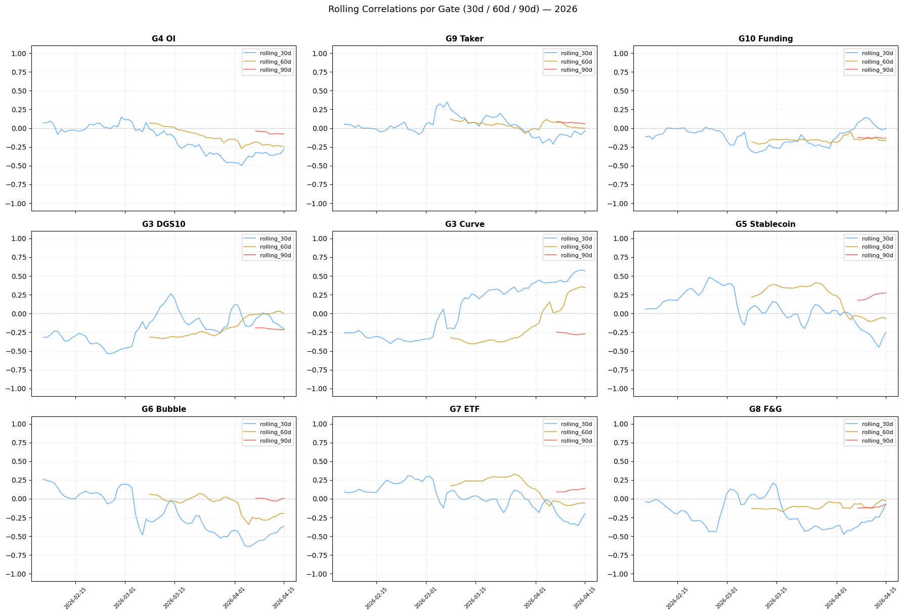
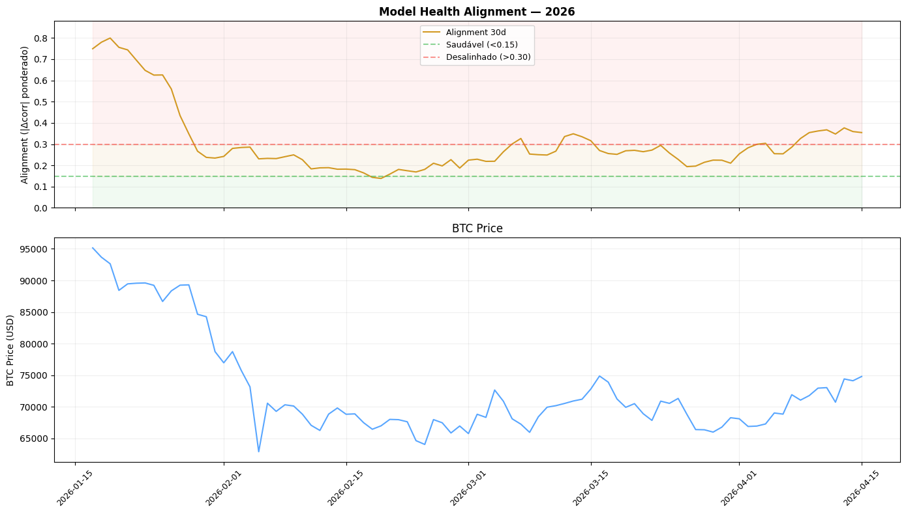

# Prompt: Estudo de Adaptação de Gates — Fase 1 (Descritiva)

## Objetivo

Entender o que está acontecendo com os gates do AI.hab em 2026 antes de decidir como adaptar o sistema. Esta é a fase **descritiva** (diagnóstico). A Fase 2 virá depois com a parte **prescritiva** (remédio).

Pergunta central: **"O modelo sabe quando não confiar em si mesmo?"**

## Escopo desta fase

Três camadas de análise:

1. **Camada 1** — Estabilidade dos Gates (quais mudaram em 2026?)
2. **Camada 4** — Model Health vs PnL (alignment prediz performance?)
3. **Camada 6** — Detecção de Regime via Alignment (alignment funciona como regime detector?)

## Entregáveis

1. Script: `scripts/analysis/estudo_adaptacao_fase1.py`
2. Relatório markdown: `prompts/estudo_adaptacao_gates_fase1.md`
3. Plots PNG em `prompts/plots/fase1/`
4. Tabelas CSV em `prompts/tables/fase1/`

## Estrutura do Script

```python
"""
Estudo de Adaptação de Gates — Fase 1 (Descritiva)

Analisa a estabilidade dos gates do AI.hab em 2026 e investiga se
o 'model alignment' pode ser usado como indicador de risco do sistema.

Saídas:
- Relatório markdown com conclusões
- Plots de correlações rolling e alignment
- Tabelas CSV com métricas por gate e por período
"""
import sys
from pathlib import Path
import pandas as pd
import numpy as np
import matplotlib.pyplot as plt
import yaml

ROOT = Path(__file__).resolve().parents[2]
sys.path.insert(0, str(ROOT))

OUTPUT_DIR = ROOT / "prompts"
PLOTS_DIR = OUTPUT_DIR / "plots" / "fase1"
TABLES_DIR = OUTPUT_DIR / "tables" / "fase1"
PLOTS_DIR.mkdir(parents=True, exist_ok=True)
TABLES_DIR.mkdir(parents=True, exist_ok=True)
```

---

## CAMADA 1 — Estabilidade dos Gates

### 1.1 Carregamento de Dados

```python
def load_data():
    """Load z-scores, prices, trades, and gate params from parameters.yml."""
    zs = pd.read_parquet(ROOT / "data/02_features/gate_zscores.parquet")
    spot = pd.read_parquet(ROOT / "data/02_intermediate/spot/btc_1h_clean.parquet")
    
    with open(ROOT / "conf/parameters.yml") as f:
        params = yaml.safe_load(f)
    
    trades_path = ROOT / "data/05_output/trades.parquet"
    trades = pd.read_parquet(trades_path) if trades_path.exists() else pd.DataFrame()
    
    # Resample to daily
    zs["timestamp"] = pd.to_datetime(zs["timestamp"], utc=True)
    zs_daily = zs.set_index("timestamp").resample("1D").last()
    
    spot["timestamp"] = pd.to_datetime(spot["timestamp"], utc=True)
    spot_daily = spot.set_index("timestamp").resample("1D")["close"].last()
    
    # Forward return 3 days (same as calibration alerts in dashboard)
    ret_3d = spot_daily.pct_change(3).shift(-3) * 100  # forward return, 3 dias à frente
    
    return zs_daily, spot_daily, ret_3d, params, trades
```

### 1.2 Mapeamento Gate → Z-score column

```python
GATE_MAP = {
    "oi_z":         ("g4_oi",       "G4 OI"),
    "taker_z":      ("g9_taker",    "G9 Taker"),
    "funding_z":    ("g10_funding", "G10 Funding"),
    "dgs10_z":      ("g3_dgs10",    "G3 DGS10"),
    "curve_z":      ("g3_curve",    "G3 Curve"),
    "stablecoin_z": ("g5_stable",   "G5 Stablecoin"),
    "bubble_z":     ("g6_bubble",   "G6 Bubble"),
    "etf_z":        ("g7_etf",      "G7 ETF"),
    "fg_z":         ("g8_fg",       "G8 F&G"),
}
```

### 1.3 Correlação Mensal (Jan/Fev/Mar/Abr 2026)

```python
def compute_monthly_corr(zs_daily, ret_3d):
    """Correlação de cada gate com forward return 3d, por mês de 2026."""
    rows = []
    months = [("Jan", "2026-01"), ("Feb", "2026-02"), ("Mar", "2026-03"), ("Apr", "2026-04")]
    
    for zcol, (gkey, gname) in GATE_MAP.items():
        if zcol not in zs_daily.columns:
            continue
        row = {"gate": gname, "zcol": zcol, "param_key": gkey}
        for month_name, month_start in months:
            mask = (zs_daily.index >= month_start) & (zs_daily.index < f"{month_start[:4]}-{int(month_start[5:])+1:02d}-01" if month_start[5:] != "12" else f"{int(month_start[:4])+1}-01-01")
            z_month = zs_daily.loc[mask, zcol]
            r_month = ret_3d.loc[mask]
            merged = pd.concat([z_month, r_month], axis=1).dropna()
            if len(merged) >= 10:
                corr = merged.iloc[:, 0].corr(merged.iloc[:, 1])
                row[month_name] = round(corr, 3)
                row[f"{month_name}_n"] = len(merged)
            else:
                row[month_name] = None
                row[f"{month_name}_n"] = len(merged)
        rows.append(row)
    
    return pd.DataFrame(rows)
```

### 1.4 Correlação Rolling (30d, 60d, 90d)

```python
def compute_rolling_corr(zs_daily, ret_3d, windows=[30, 60, 90]):
    """Correlação rolling por gate, múltiplas janelas."""
    results = {}
    for zcol, (gkey, gname) in GATE_MAP.items():
        if zcol not in zs_daily.columns:
            continue
        df = pd.concat([zs_daily[zcol], ret_3d], axis=1).dropna()
        df.columns = [zcol, "ret_3d"]
        
        results[gname] = {}
        for w in windows:
            rolling = df[zcol].rolling(w).corr(df["ret_3d"])
            results[gname][f"rolling_{w}d"] = rolling
    
    return results
```

### 1.5 Classificação de Estabilidade

```python
def classify_stability(monthly_df, rolling_results, gate_params):
    """
    Classificar cada gate como:
    - STABLE: direção consistente em todos os meses, magnitude estável
    - WEAKENING: direção consistente, magnitude decaindo
    - UNSTABLE: magnitude varia muito mas direção mantém
    - BROKEN: mudou de sinal OU correlação próxima de zero (<0.05)
    """
    classifications = []
    
    for _, row in monthly_df.iterrows():
        gate = row["gate"]
        gkey = row["param_key"]
        corr_cfg = gate_params.get("gate_params", {}).get(gkey, [0])[0] if gkey else 0
        
        months = [row.get("Jan"), row.get("Feb"), row.get("Mar"), row.get("Apr")]
        months_valid = [m for m in months if m is not None]
        
        if len(months_valid) < 2:
            status = "INSUFFICIENT_DATA"
            reason = "Menos de 2 meses com dados"
        else:
            signs = [np.sign(m) for m in months_valid]
            sign_changes = sum(1 for i in range(1, len(signs)) if signs[i] != signs[i-1] and signs[i] != 0 and signs[i-1] != 0)
            mean_abs = np.mean([abs(m) for m in months_valid])
            std_abs = np.std([abs(m) for m in months_valid])
            last_corr = months_valid[-1]
            
            # Direção do config
            cfg_sign = np.sign(corr_cfg)
            
            if abs(last_corr) < 0.05:
                status = "BROKEN"
                reason = f"Correlação atual próxima de zero ({last_corr:+.3f})"
            elif sign_changes >= 2:
                status = "BROKEN"
                reason = f"{sign_changes} inversões de sinal em 2026"
            elif cfg_sign != 0 and np.sign(last_corr) != cfg_sign and abs(last_corr) > 0.1:
                status = "BROKEN"
                reason = f"Sinal invertido vs config (cfg={corr_cfg:+.3f}, atual={last_corr:+.3f})"
            elif std_abs / mean_abs > 0.4 if mean_abs > 0 else False:
                status = "UNSTABLE"
                reason = f"Alta variância ({std_abs:.3f}/{mean_abs:.3f})"
            elif len(months_valid) >= 3 and all(abs(months_valid[i]) < abs(months_valid[i-1]) for i in range(1, len(months_valid))):
                status = "WEAKENING"
                reason = "Magnitude decaindo progressivamente"
            else:
                status = "STABLE"
                reason = "Direção consistente, magnitude estável"
        
        classifications.append({
            "gate": gate,
            "corr_cfg": corr_cfg,
            **{m: row.get(m) for m in ["Jan", "Feb", "Mar", "Apr"]},
            "status": status,
            "reason": reason,
        })
    
    return pd.DataFrame(classifications)
```

### 1.6 Plots Camada 1

```python
def plot_rolling_correlations(rolling_results, output_path):
    """Um plot por gate mostrando rolling 30d/60d/90d."""
    n_gates = len(rolling_results)
    fig, axes = plt.subplots(3, 3, figsize=(18, 12), sharex=True)
    axes = axes.flatten()
    
    for i, (gate, data) in enumerate(rolling_results.items()):
        ax = axes[i]
        for window_name, series in data.items():
            ax.plot(series.index, series.values, label=window_name, alpha=0.7, linewidth=1.2)
        ax.axhline(0, color="grey", linestyle="--", alpha=0.3)
        ax.set_title(gate, fontsize=11)
        ax.legend(fontsize=8, loc="best")
        ax.grid(True, alpha=0.3)
        ax.tick_params(axis="x", rotation=45, labelsize=8)
    
    plt.tight_layout()
    plt.savefig(output_path, dpi=100, bbox_inches="tight")
    plt.close()
```

---

## CAMADA 4 — Model Health vs PnL

### 4.1 Cálculo de Alignment Diário

```python
def compute_daily_alignment(zs_daily, ret_3d, gate_params, window=30):
    """
    Para cada dia, calcula:
    - alignment = média ponderada de |corr_cfg - corr_real_window| pelos pesos dos gates
    """
    alignment_series = []
    
    for date in zs_daily.index[window:]:
        deltas = []
        for zcol, (gkey, gname) in GATE_MAP.items():
            if zcol not in zs_daily.columns or gkey not in gate_params.get("gate_params", {}):
                continue
            cfg = gate_params["gate_params"][gkey]
            corr_cfg = cfg[0]
            weight = cfg[2] if len(cfg) >= 3 else 1.0
            
            # Rolling window ending at date
            window_start = date - pd.Timedelta(days=window)
            z_win = zs_daily.loc[window_start:date, zcol]
            r_win = ret_3d.loc[window_start:date]
            merged = pd.concat([z_win, r_win], axis=1).dropna()
            
            if len(merged) < 10:
                continue
            
            corr_real = merged.iloc[:, 0].corr(merged.iloc[:, 1])
            delta = abs(corr_real - corr_cfg)
            deltas.append((delta, weight))
        
        if deltas:
            total_w = sum(w for _, w in deltas)
            weighted_avg = sum(d * w for d, w in deltas) / total_w
            alignment_series.append({
                "date": date,
                "alignment": weighted_avg,
                "n_gates": len(deltas),
            })
    
    return pd.DataFrame(alignment_series)
```

### 4.2 Correlacionar Alignment com Performance

```python
def alignment_vs_performance(alignment_df, spot_daily, window=30):
    """
    Para cada ponto do alignment, calcular forward performance em 7d e 30d.
    Depois correlacionar alignment com:
    - forward_return_7d
    - forward_return_30d
    - volatility_7d
    - max_drawdown_7d
    """
    df = alignment_df.copy().set_index("date")
    
    # Forward returns
    df["spot_price"] = spot_daily.reindex(df.index)
    df["forward_ret_7d"] = (spot_daily.shift(-7) / spot_daily - 1).reindex(df.index) * 100
    df["forward_ret_30d"] = (spot_daily.shift(-30) / spot_daily - 1).reindex(df.index) * 100
    
    # Forward volatility
    daily_ret = spot_daily.pct_change()
    df["forward_vol_7d"] = daily_ret.rolling(7).std().shift(-7).reindex(df.index) * np.sqrt(7) * 100
    
    # Forward drawdown (next 7 days max drawdown)
    def forward_dd(idx, n=7):
        try:
            future = spot_daily.loc[idx : idx + pd.Timedelta(days=n)]
            if len(future) < 2:
                return None
            peak = future.cummax()
            dd = (future / peak - 1).min() * 100
            return dd
        except Exception:
            return None
    
    df["forward_dd_7d"] = [forward_dd(d) for d in df.index]
    
    # Correlations
    correlations = {
        "alignment_vs_ret_7d": df["alignment"].corr(df["forward_ret_7d"]),
        "alignment_vs_ret_30d": df["alignment"].corr(df["forward_ret_30d"]),
        "alignment_vs_vol_7d": df["alignment"].corr(df["forward_vol_7d"]),
        "alignment_vs_dd_7d": df["alignment"].corr(df["forward_dd_7d"]),
    }
    
    return df, correlations
```

### 4.3 Plot Alignment Time Series

```python
def plot_alignment_with_price(alignment_df, spot_daily, output_path):
    """Plot duplo: alignment + preço BTC."""
    fig, (ax1, ax2) = plt.subplots(2, 1, figsize=(14, 8), sharex=True)
    
    df = alignment_df.set_index("date")
    ax1.plot(df.index, df["alignment"], color="#d29922", linewidth=1.5, label="Alignment 30d")
    ax1.axhline(0.15, color="#3fb950", linestyle="--", alpha=0.5, label="Saudável (<0.15)")
    ax1.axhline(0.30, color="#f85149", linestyle="--", alpha=0.5, label="Desalinhado (>0.30)")
    ax1.fill_between(df.index, 0, 0.15, alpha=0.1, color="#3fb950")
    ax1.fill_between(df.index, 0.15, 0.30, alpha=0.1, color="#d29922")
    ax1.fill_between(df.index, 0.30, df["alignment"].max(), alpha=0.1, color="#f85149")
    ax1.set_ylabel("Alignment")
    ax1.set_title("Model Health Alignment — 2026")
    ax1.legend(fontsize=9)
    ax1.grid(True, alpha=0.3)
    
    spot_plot = spot_daily.reindex(df.index)
    ax2.plot(spot_plot.index, spot_plot.values, color="#58a6ff", linewidth=1.5)
    ax2.set_ylabel("BTC Price ($)")
    ax2.set_title("BTC Price")
    ax2.grid(True, alpha=0.3)
    
    plt.tight_layout()
    plt.savefig(output_path, dpi=100, bbox_inches="tight")
    plt.close()
```

---

## CAMADA 6 — Detecção de Regime via Alignment

### 6.1 Classificação de Regime

```python
def classify_regime_by_alignment(alignment_df, thresholds=(0.20, 0.35)):
    """
    - alignment < 0.20 → STABLE
    - 0.20 <= alignment <= 0.35 → TRANSITION
    - alignment > 0.35 → UNSTABLE
    """
    df = alignment_df.copy()
    
    def classify(a):
        if a < thresholds[0]:
            return "STABLE"
        elif a <= thresholds[1]:
            return "TRANSITION"
        else:
            return "UNSTABLE"
    
    df["regime_alignment"] = df["alignment"].apply(classify)
    return df
```

### 6.2 Performance por Regime

```python
def performance_by_regime(alignment_with_perf_df):
    """Agrupa forward returns por regime e calcula estatísticas."""
    df = alignment_with_perf_df.copy()
    
    summary = df.groupby("regime_alignment").agg({
        "forward_ret_7d": ["mean", "median", "std", "count"],
        "forward_ret_30d": ["mean", "median", "std"],
        "forward_vol_7d": "mean",
        "forward_dd_7d": "mean",
    }).round(2)
    
    return summary
```

### 6.3 Regime Transitions

```python
def analyze_regime_transitions(regime_df):
    """
    Detecta transições de regime e conta duração de cada período.
    Útil para saber se regimes duram horas, dias ou semanas.
    """
    df = regime_df.copy().sort_values("date")
    df["regime_change"] = df["regime_alignment"] != df["regime_alignment"].shift(1)
    df["regime_id"] = df["regime_change"].cumsum()
    
    periods = df.groupby("regime_id").agg(
        regime=("regime_alignment", "first"),
        start=("date", "first"),
        end=("date", "last"),
        duration_days=("date", lambda x: (x.max() - x.min()).days + 1),
    ).reset_index(drop=True)
    
    return periods
```

---

## Relatório Markdown (Output)

Gerar um arquivo `prompts/estudo_adaptacao_gates_fase1.md` com seções:

```markdown
# Estudo de Adaptação de Gates — Fase 1 (Descritiva)

Data: YYYY-MM-DD
Período analisado: 2026-01-01 a [hoje]

## Resumo Executivo

[3-5 bullets com as principais descobertas]

## Camada 1 — Estabilidade dos Gates

### Classificação por Gate

| Gate | Config | Jan | Feb | Mar | Apr | Status | Razão |
|------|--------|-----|-----|-----|-----|--------|-------|
| G4 OI | -0.472 | -0.xx | -0.xx | -0.xx | +0.xx | BROKEN | ... |
| G7 ETF | +0.263 | +0.xx | +0.xx | +0.xx | +0.xx | STABLE | ... |
| ... |

### Plots



### Interpretação

[Análise dos padrões observados]

## Camada 4 — Model Health vs PnL

### Série Temporal do Alignment



### Correlações Alignment vs Performance

| Métrica | Correlação |
|---------|-----------|
| Alignment vs Return 7d | X.XX |
| Alignment vs Return 30d | X.XX |
| Alignment vs Vol 7d | X.XX |
| Alignment vs DD 7d | X.XX |

### Interpretação

[Quando alignment alto, o que acontece com performance?]

## Camada 6 — Detecção de Regime

### Distribuição de Regimes em 2026

| Regime | N dias | % tempo |
|--------|--------|---------|
| STABLE | X | XX% |
| TRANSITION | X | XX% |
| UNSTABLE | X | XX% |

### Performance Forward por Regime

| Regime | Ret 7d médio | Vol 7d | DD 7d |
|--------|-------------|--------|-------|
| STABLE | +X.XX% | X.X% | -X.X% |
| TRANSITION | +X.XX% | X.X% | -X.X% |
| UNSTABLE | +X.XX% | X.X% | -X.X% |

### Durações de Regime

[Tabela com períodos de cada regime]

### Interpretação

[O alignment funciona como regime detector?]

## Conclusões e Próximos Passos

### O que aprendemos

1. [principal insight]
2. [segundo insight]
3. [terceiro insight]

### Recomendações para Fase 2

- [ ] ...
- [ ] ...

### Questões em aberto

- [ ] ...
```

---

## Função Main

```python
def main():
    print("=" * 60)
    print("Estudo de Adaptação de Gates — Fase 1 (Descritiva)")
    print("=" * 60)
    
    # Load data
    print("\n1. Carregando dados...")
    zs_daily, spot_daily, ret_3d, params, trades = load_data()
    print(f"   Z-scores: {len(zs_daily)} dias")
    print(f"   Preços: {len(spot_daily)} dias")
    print(f"   Trades: {len(trades)}")
    
    # CAMADA 1
    print("\n2. CAMADA 1 — Estabilidade dos Gates...")
    monthly_df = compute_monthly_corr(zs_daily, ret_3d)
    rolling_results = compute_rolling_corr(zs_daily, ret_3d)
    stability_df = classify_stability(monthly_df, rolling_results, params)
    
    monthly_df.to_csv(TABLES_DIR / "monthly_correlations.csv", index=False)
    stability_df.to_csv(TABLES_DIR / "gate_stability.csv", index=False)
    plot_rolling_correlations(rolling_results, PLOTS_DIR / "rolling_correlations.png")
    
    print(f"   Status: {stability_df['status'].value_counts().to_dict()}")
    
    # CAMADA 4
    print("\n3. CAMADA 4 — Model Health vs PnL...")
    alignment_df = compute_daily_alignment(zs_daily, ret_3d, params, window=30)
    alignment_with_perf, perf_corrs = alignment_vs_performance(alignment_df, spot_daily)
    
    alignment_df.to_csv(TABLES_DIR / "daily_alignment.csv", index=False)
    alignment_with_perf.to_csv(TABLES_DIR / "alignment_vs_performance.csv")
    plot_alignment_with_price(alignment_df, spot_daily, PLOTS_DIR / "alignment_time_series.png")
    
    print(f"   Correlações:")
    for k, v in perf_corrs.items():
        print(f"     {k}: {v:+.3f}")
    
    # CAMADA 6
    print("\n4. CAMADA 6 — Detecção de Regime...")
    regime_df = classify_regime_by_alignment(alignment_with_perf.reset_index())
    perf_by_regime = performance_by_regime(regime_df)
    transitions = analyze_regime_transitions(regime_df)
    
    regime_df.to_csv(TABLES_DIR / "regime_by_alignment.csv", index=False)
    perf_by_regime.to_csv(TABLES_DIR / "performance_by_regime.csv")
    transitions.to_csv(TABLES_DIR / "regime_transitions.csv", index=False)
    
    regime_counts = regime_df["regime_alignment"].value_counts()
    print(f"   Distribuição: {regime_counts.to_dict()}")
    
    # Generate markdown report
    print("\n5. Gerando relatório markdown...")
    generate_report(stability_df, alignment_df, perf_corrs, perf_by_regime, transitions)
    
    print(f"\n✅ Estudo completo. Ver: {OUTPUT_DIR}/estudo_adaptacao_gates_fase1.md")


def generate_report(stability_df, alignment_df, perf_corrs, perf_by_regime, transitions):
    """Gera o markdown final com todas as descobertas."""
    # ... implementação que monta o markdown dinamicamente com os resultados
    pass


if __name__ == "__main__":
    main()
```

---

## Execução

O script deve rodar dentro do container Docker (tem acesso aos parquets):

```bash
# No EC2
docker exec aihab-app python3 /app/scripts/analysis/estudo_adaptacao_fase1.py

# Copiar outputs para o host
docker cp aihab-app:/app/prompts/estudo_adaptacao_gates_fase1.md ~/AIhab/prompts/
docker cp aihab-app:/app/prompts/plots/fase1/. ~/AIhab/prompts/plots/fase1/
docker cp aihab-app:/app/prompts/tables/fase1/. ~/AIhab/prompts/tables/fase1/
```

Ou localmente (se tiver os parquets):

```bash
cd ~/AIhab
python3 scripts/analysis/estudo_adaptacao_fase1.py
```

---

## Checklist

1. [ ] Criar `scripts/analysis/estudo_adaptacao_fase1.py`
2. [ ] Camada 1: monthly_corr, rolling_corr, classify_stability
3. [ ] Camada 1: plot rolling correlations (9 subplots)
4. [ ] Camada 4: daily alignment calculation
5. [ ] Camada 4: alignment vs performance correlation
6. [ ] Camada 4: plot alignment + BTC price
7. [ ] Camada 6: classify regime by alignment
8. [ ] Camada 6: performance by regime
9. [ ] Camada 6: regime transitions
10. [ ] Função `generate_report()` que monta markdown
11. [ ] Rodar script e gerar outputs
12. [ ] Criar `prompts/estudo_adaptacao_gates_fase1.md`
13. [ ] Git commit + push (incluir plots, tables, markdown)

## Notas

- **NÃO modifica** nenhum código do trading system
- Script puramente analítico, zero risco
- Usa os mesmos dados que o dashboard já consome
- Output em markdown + plots + CSVs para análise posterior
- A Fase 2 (prescritiva) virá depois, baseada nos achados desta fase

## Bibliotecas necessárias

- pandas, numpy, matplotlib, pyyaml (já disponíveis no container)
