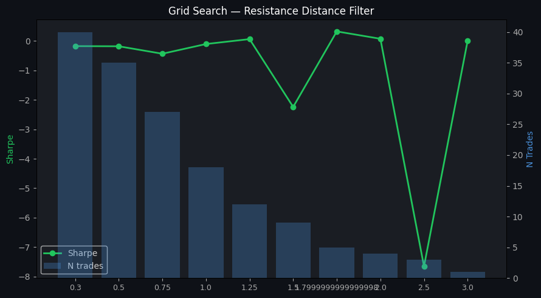

# SOL Bot 4 — Estudo de Filtros Estruturais

**Data:** 2026-04-22
**Trigger:** primeira trade live -0.98% (fase tardia rally)
**Entry:** $88.23 @ 16:15 UTC | **Exit:** $87.37 @ 19:43 UTC (TRAIL) | **Duration:** 3h 28min

---

## 1. Baseline

| Metric | Value |
|--------|-------|
| Sharpe | 0.08 |
| Trades | 55 |
| Win Rate | 35% |
| Avg Return | 0.013% |
| Max DD | -6.90% |
| Total Return | 0.38% |
| Profit Factor | 1.03 |

> Target: Sharpe ~2.03 (Phase 2 backtest original)

---

## 2. Análise univariada (por feature)

### dist_to_resistance_pct
| Bucket | N | WR | Avg Return | Sharpe |
|--------|---|----|------------|--------|
| <0.5%        | 11 | 18% | -0.429% | -5.78 |
| 0.5-1%       | 11 | 36% | 0.195% | 1.13 |
| 1-1.5%       |  6 | 33% | 0.259% | 1.36 |
| 1.5-2%       |  1 | 0% | -1.000% | 0.00 |
| 2-3%         |  3 | 67% | 0.352% | 1.67 |

### structural_rr
| Bucket | N | WR | Avg Return | Sharpe |
|--------|---|----|------------|--------|
| <0.2         | 15 | 27% | -0.128% | -0.93 |
| 0.2-0.4      | 11 | 45% | 0.240% | 1.41 |
| 0.4-0.6      |  3 | 33% | 0.080% | 0.35 |
| 0.6-1.0      |  3 | 0% | -0.640% | -12.14 |

### volume_z
| Bucket | N | WR | Avg Return | Sharpe |
|--------|---|----|------------|--------|
| -1-0         | 20 | 20% | -0.271% | -1.84 |
| 0-0.5        | 10 | 60% | 0.456% | 2.84 |
| 0.5-1        |  9 | 33% | 0.064% | 0.40 |
| 1-1.5        |  5 | 40% | 0.542% | 2.89 |
| 1.5-2        |  3 | 33% | -0.325% | -6.80 |
| >2           |  8 | 38% | -0.093% | -0.60 |

### close_ma21_ratio
| Bucket | N | WR | Avg Return | Sharpe |
|--------|---|----|------------|--------|
| 1.0-1.01     |  9 | 33% | 0.040% | 0.34 |
| 1.01-1.02    | 22 | 32% | -0.055% | -0.36 |
| 1.02-1.03    | 13 | 15% | -0.515% | -4.23 |
| 1.03-1.05    |  8 | 62% | 1.036% | 5.55 |
| >1.05        |  3 | 67% | -0.015% | -0.13 |

### velocity_ratio
| Bucket | N | WR | Avg Return | Sharpe |
|--------|---|----|------------|--------|
| <-1          | 10 | 40% | 0.073% | 0.47 |
| -1-0         |  5 | 40% | 0.318% | 2.29 |
| 0.5-1        |  3 | 67% | 0.606% | 2.91 |
| 1-2          |  4 | 0% | -0.762% | -11.55 |
| 2-5          |  4 | 25% | -0.145% | -2.53 |
| >5           | 23 | 30% | -0.064% | -0.39 |

---

## 3. Teste de filtros isolados

| Config | N | WR | Avg Return | Sharpe | Δ vs baseline | Kept |
|--------|---|----|------------|--------|---------------|------|
| baseline                       |  55 | 35% | 0.013% | 0.08 | +0.00 | 100% |
| resistance_>1%                 |  18 | 39% | -0.017% | -0.11 | -0.19 | 33% |
| resistance_>2%                 |   4 | 50% | 0.014% | 0.07 | -0.01 | 7% |
| struct_rr_>0.3                 |  24 | 29% | -0.227% | -1.69 | -1.77 | 44% |
| struct_rr_>0.5                 |  11 | 18% | -0.618% | -8.73 | -8.81 | 20% |
| volume_z_<1.0                  |  43 | 33% | -0.089% | -0.62 | -0.71 | 78% |
| volume_z_<1.5                  |  49 | 35% | 0.018% | 0.12 | +0.03 | 89% |
| extension_<1.03                |  45 | 27% | -0.178% | -1.31 | -1.39 | 82% |
| extension_<1.05                |  53 | 32% | -0.005% | -0.03 | -0.11 | 96% |
| velocity_<2.0                  |  40 | 32% | -0.087% | -0.57 | -0.66 | 73% |

---

## 4. Filtros combinados

| Config | N | WR | Sharpe | Δ vs baseline | Kept |
|--------|---|-----|--------|---------------|------|
| combo_resistance+volume        | 15 | 33% | -0.64 | -0.72 | 27% |
| combo_rr+extension             | 20 | 20% | -2.51 | -2.59 | 36% |
| combo_resistance+rr            | 15 | 40% | -0.36 | -0.44 | 27% |
| combo_resistance+rr+volume     | 14 | 36% | -0.24 | -0.33 | 25% |

---

## 5. Grid search — Distance to Resistance

| Threshold | N | WR | Sharpe | Δ |
|-----------|---|-----|--------|---|
| 0.3% | 40 | 38% | -0.18 | -0.26 |
| 0.5% | 35 | 34% | -0.18 | -0.27 |
| 0.8% | 27 | 37% | -0.44 | -0.52 |
| 1.0% | 18 | 39% | -0.11 | -0.19 |
| 1.2% | 12 | 42% | 0.06 | -0.02 |
| 1.5% | 9 | 33% | -2.24 | -2.32 |
| 1.8% | 5 | 60% | 0.32 | +0.24 |
| 2.0% | 4 | 50% | 0.07 | -0.01 |
| 2.5% | 3 | 33% | -7.65 | -7.74 |
| 3.0% | 1 | 0% | 0.00 | -0.08 |

**Melhor threshold:** 1.8%
**Sharpe resultante:** 0.32 (Δ=+0.24)

---

## 6. Análise da trade live (22/04)

**Features estruturais no momento da entrada ($88.23):**

| Feature | Valor | Filtro aplicado |
|---------|-------|-----------------|
| dist_to_resistance_12h | 0.54% | > 1.8%? |
| structural_rr | 0.192 | > 0.3? |
| volume_z | 0.218 | < 1.0? |
| close/MA21 | 1.0181 | < 1.03? |
| velocity_ratio | -3.143 | < 2.0? |

**Diagnóstico:** Entry a 0.54% da resistência 12h ($88.55).
TP ($89.99) exigia +2.0% furar a resistência. R/R estrutural = 0.09.

- **resistance_>1%**: dist=0.54%, vol_z=0.22 → 🛡️ BLOCKED
- **resistance_>2%**: dist=0.54%, vol_z=0.22 → 🛡️ BLOCKED
- **struct_rr_>0.3**: dist=0.54%, vol_z=0.22 → 🛡️ BLOCKED
- **struct_rr_>0.5**: dist=0.54%, vol_z=0.22 → 🛡️ BLOCKED
- **volume_z_<1.0**: dist=0.54%, vol_z=0.22 → ✅ allowed
- **volume_z_<1.5**: dist=0.54%, vol_z=0.22 → ✅ allowed
- **extension_<1.03**: dist=0.54%, vol_z=0.22 → ✅ allowed
- **extension_<1.05**: dist=0.54%, vol_z=0.22 → ✅ allowed
- **velocity_<2.0**: dist=0.54%, vol_z=0.22 → ✅ allowed

---

## 7. Recomendação

### Nenhum filtro atende todos os critérios

Melhor candidato: `volume_z_<1.5` (Sharpe 0.12, Δ=+0.03)

- Sharpe delta ≥ 0.3: ❌ (+0.03)
- Trades mantidos ≥ 60%: ✅ (89%)
- Bloqueia trade live: ❌

**Conclusão:** Trade 22/04 foi evento N=1. Strategy original válida. Continuar monitorando.

> Revisitar quando N ≥ 30 trades (poder estatístico suficiente).

---

## 8. Plots gerados

- `plots/sol_filters_study/scatter_features.png` — Feature vs Return por trade
- `plots/sol_filters_study/filter_comparison_bars.png` — Comparação de Sharpe por filtro
- `plots/sol_filters_study/grid_search_threshold.png` — Grid search resistência

## 9. Tabelas geradas

- `tables/sol_filters_study/univariate_analysis.csv`
- `tables/sol_filters_study/filter_comparison.csv`
- `tables/sol_filters_study/grid_search_results.csv`
